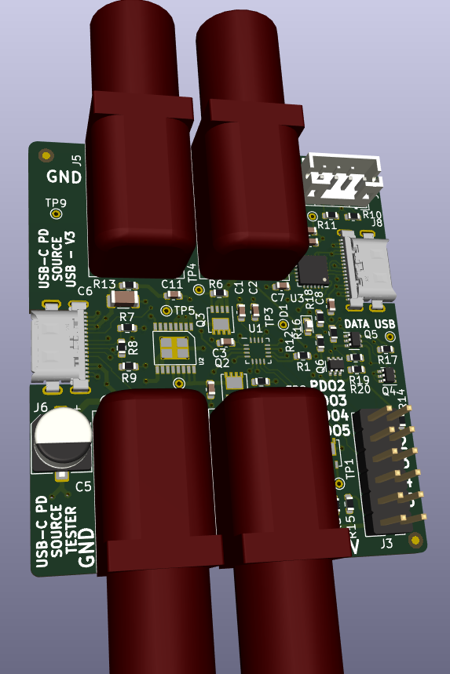

# USB-C_PD_PSU_simulator

USB-C PD power supply simulator based on STUSB4710 with CP2112 USB/I2C interface chip

### Introduction

- USB-C power delivery powers supply simulator based on STUSB4710
- can be used to simulated non conformant power supplies
- e.g. output different voltage than the one being negotiated
- manipulate offered contracts to simulate specific power supplies
- layout and schematic has been realized with KiCad 6
- correspondig software is written with python 3
- communication with STUSB4710 is realized with SiLabs 2112 USB to I2C/SMBUS interface chip

### Hardware Setup



Find schematic as PDF [here](./ECAD/USB-C_PSU_Simulator.pdf)

### Usage
- install python3 if not already installed; e.g. https://winpython.github.io/ for Windows users
- download from www.silabs.com the driver containing the files 'SLABHIDDevice.*' and 'SLABHIDtoSMBus.*' (extension .dll for Windows)
- copy both files into 'Software' subdirectory
- execute e.g. 'python configSTUSB4710.py' in the 'Software' subdirectory
```
python configSTUSB4710.py
usage: configSTUSB4710.py [-h] [-r] [--setToleranceVBUS [0-15]] [--setPDO SETPDO [SETPDO ...]] [--printRDO] [--printPDO] [--printNVM] [--printToleranceVBUS] [--printVBUSControl] [--printPortStatus]
                          [--printSTUSBVersion] [-v]

Configure STUSB4710 for USB-C PD power supply simulation; (c) 12/2022 Steffen Mauch; MIT license

optional arguments:
  -h, --help            show this help message and exit
  -r, --resetSTUSB      reset STUSB4710 via command
  --setToleranceVBUS [0-15]
                        set additional VBUS tolerance in percent of STUSB4710
  --setPDO SETPDO [SETPDO ...]
                        modify PDO of STUSB4710; first argument selects #PDO;second argument voltage in [mv]; third argument current in [mA] e.g. 1 5000 2000 will set PDO1 to 5V and 2A
  --printRDO            shows actual settings requested data object (RDO) of STUSB4710
  --printPDO            shows actual settings power data object (PDO) of STUSB4710
  --printNVM            shows actual content of non volatile memory (NVM) of STUSB4710
  --printToleranceVBUS  get full VBUS tolerance in percent of STUSB4710 [incl. 5 percent default]
  --printVBUSControl    get VBUS control register of STUSB4710
  --printPortStatus     get port status register of STUSB4710
  --printSTUSBVersion   get version register of STUSB4710
  -v, --version         show version of python script
```
- show advertised src of USB-C PD
```
python configSTUSB4710.py --printPDO

PDO SRC#1:  PdoSink(voltage=5.0V, current=3.0A, fastRoleReqCur=0, dualRoleData=0, usbCommunicationsCapable=0, unconstrainedPower=1, higherCapability=0, dualRolePower=0, supply=Fixed, raw=0x0801912c)
PDO SRC#2:  PdoSink(voltage=9.0V, current=3.0A, fastRoleReqCur=0, dualRoleData=0, usbCommunicationsCapable=0, unconstrainedPower=0, higherCapability=0, dualRolePower=0, supply=Fixed, raw=0x0002d12c)
PDO SRC#3:  PdoSink(voltage=12.0V, current=3.0A, fastRoleReqCur=0, dualRoleData=0, usbCommunicationsCapable=0, unconstrainedPower=0, higherCapability=0, dualRolePower=0, supply=Fixed, raw=0x0003c12c)
PDO SRC#4:  PdoSink(voltage=15.0V, current=3.0A, fastRoleReqCur=0, dualRoleData=0, usbCommunicationsCapable=0, unconstrainedPower=0, higherCapability=0, dualRolePower=0, supply=Fixed, raw=0x0004b12c)
PDO SRC#5:  PdoSink(voltage=20.0V, current=2.25A, fastRoleReqCur=0, dualRoleData=0, usbCommunicationsCapable=0, unconstrainedPower=0, higherCapability=0, dualRolePower=0, supply=Fixed, raw=0x000640e1)
```

### Background information for STUSB4710
- 'dm00664189-the-stusb4500-software-programing-guide-stmicroelectronics.pdf'
- 'STUSB47xx_register_map_public.pdf'
- 'STSW-STUSB004 - Quick Start - v1.0.pdf'
- 'TNxxx - STUSB4500 NVM Description_V1.1.pdf' and 'TNxxx - STUSB4700 NVM Description.pdf' which is part of 'STSW-STUSB003' and STSW-STUSB004'


### Background information for CP2112
- API information can be found in 'AN496.pdf'


### License
[](https://opensource.org/licenses/MIT)